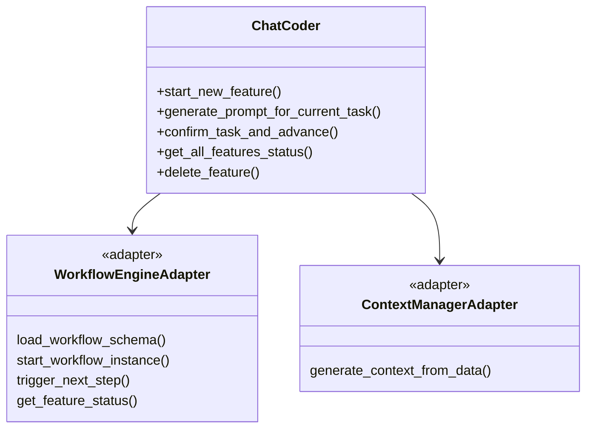
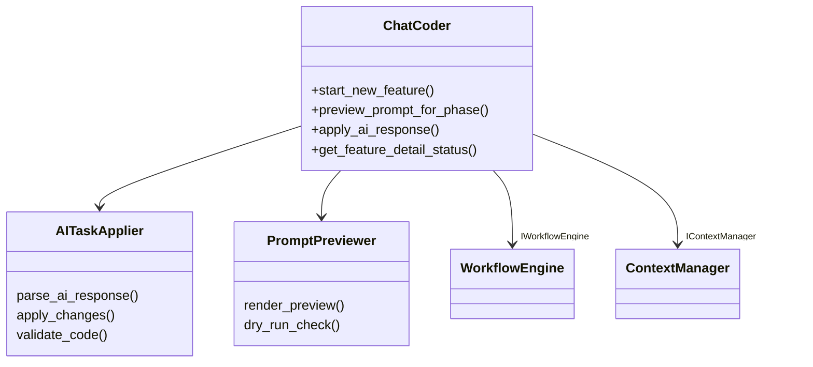
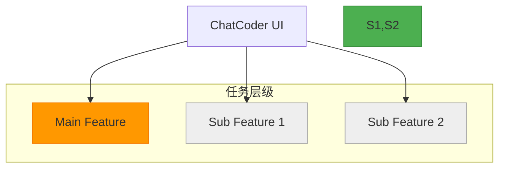
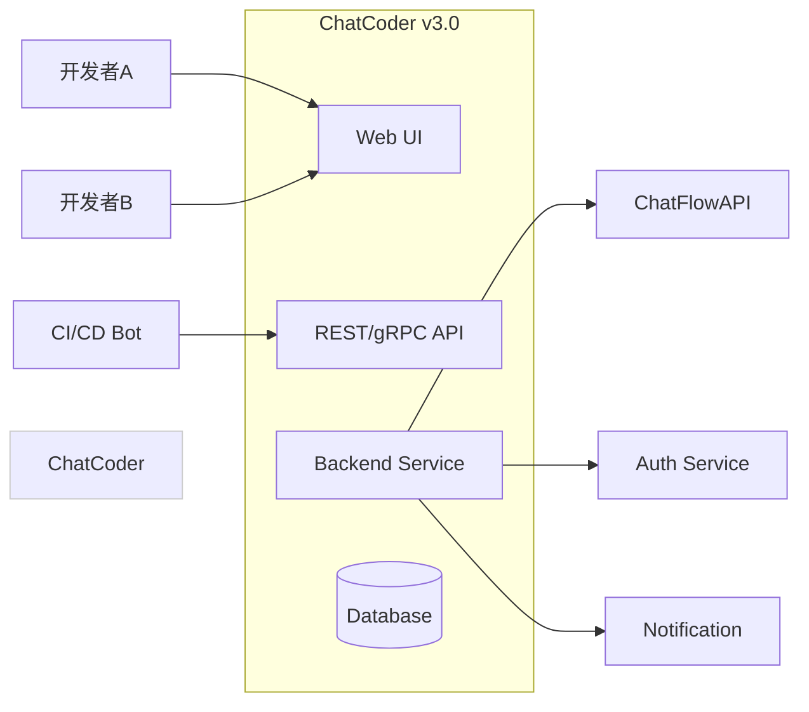
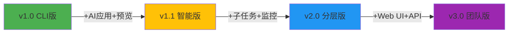

# ChatCoder 架构演进路线图：从 CLI 工具到 AI 协作平台

基于您提供的 v0.1 版本和 ChatFlow 的演进路径，我为 **ChatCoder** 设计了一套与之协同的四阶段架构演进方案。每个阶段都与对应版本的 ChatFlow 深度集成，共同构建完整的 AI 开发工作流。

---

## 🎯 核心演进理念

| 阶段 | ChatCoder 定位 | 与 ChatFlow 关系 |
|------|------------------|------------------|
| **v1.0** | 可靠 CLI 适配器 | ChatFlow v1.0 的“命令行界面” |
| **v1.1** | 智能交互代理 | ChatFlow v1.1 的“智能前端” |
| **v2.0** | 递归任务协作者 | ChatFlow v2.0 的“项目执行官” |
| **v3.0** | 团队协作中心 | ChatFlow v3.0 的“组织指挥台” |

> 演进核心：从“单机脚本”到“团队级 AI 协作中枢”，最终成为开发者与 AI Agent 之间的**智能协调层**。

---

## 📦 阶段一：v1.0 - 可靠 CLI 适配器（适配 ChatFlow v1.0）

### 定位
作为 ChatFlow v1.0 的稳定、易用的命令行接口，提供基础的启动、查询、推进功能。

### 关键设计


### 核心增强
1. **强依赖解耦**：将 `chatflow` 和 `chatcontext` 作为可选依赖，若不可用则降级为简单文件操作。
2. **统一错误处理**：捕获底层异常并转化为用户友好的错误信息。
3. **状态缓存**：对频繁查询的特性状态进行内存缓存，减少磁盘 I/O。
4. **ID 生成规范化**：使用 `orchestrator.generate_feature_id()` 统一生成 ID。

### 接口演进
```python
# chatcoder/core/chatcoder.py (v1.0)

def start_new_feature(self, description: str) -> Dict[str, str]:
    """启动新特性"""
    # 调用 ChatFlow 接口
    instance_id = self.workflow_engine.start_workflow_instance(
        schema=..., 
        context={},
        feature_id=feature_id
    )
    return {"feature_id": feature_id}

def confirm_task_and_advance(self, feature_id: str) -> Optional[Dict[str, Any]]:
    """确认任务完成并推进"""
    # 调用 ChatFlow 接口
    updated_state = self.workflow_engine.trigger_next_step(
        instance_id=current_task_id,
        trigger_data={"summary": ai_response_summary}
    )
    # 获取下一阶段建议
    recommendation = self.workflow_engine.recommend_next_phase(feature_id)
    return recommendation
```

### 与 ChatFlow v1.0 集成
- **调用接口**：
  - `load_workflow_schema`
  - `start_workflow_instance`
  - `trigger_next_step`
  - `get_feature_status`
  - `recommend_next_phase`
- **价值**：为个人开发者提供一个可靠的自动化工具，隐藏了复杂的 API 调用细节。

---

## 🌟 阶段二：v1.1 - 智能交互代理（适配 ChatFlow v1.1）

### 定位
在可靠性的基础上增加**智能交互能力**，利用 ChatFlow v1.1 的高级特性提升用户体验。

### 关键设计


### 核心增强

#### 1. **AI 响应应用引擎**
```python
class AITaskApplier:
    def parse_ai_response(self, response: str) -> ChangeSet:
        """解析 AI 响应中的代码变更"""
        # 使用正则或 LLM 解析 ```create file.py ...``` 等模式
        changes = []
        for match in re.finditer(r'```(create|modify)\s+(\S+)\s*\n([\s\S]*?)\n```', response):
            operation, file_path, new_content = match.groups()
            changes.append({"file_path": file_path, "operation": operation, "new_content": new_content})
        return {"changes": changes}
    
    def apply_changes(self, changeset: ChangeSet) -> bool:
        """将变更应用到本地文件系统"""
        for change in changeset["changes"]:
            path = Path(change["file_path"])
            path.parent.mkdir(parents=True, exist_ok=True)
            path.write_text(change["new_content"], encoding="utf-8")
        return True
```

#### 2. **提示词预览与 Dry Run**
```python
def preview_prompt_for_phase(self, phase_name: str, feature_id: str) -> str:
    """预览特定阶段的提示词"""
    # 利用 ChatFlow v1.1 的 Dry Run 模式
    with patch.object(self.workflow_engine, 'trigger_next_step') as mock_trigger:
        mock_trigger.return_value = None
        prompt = self.ai_manager.render_prompt_for_feature_phase_preview(
            feature_id=feature_id,
            phase_name=phase_name
        )
        return prompt
```

#### 3. **精细化状态查询**
```python
def get_feature_detail_status(self, feature_id: str) -> Dict[str, Any]:
    """获取特性的详细状态"""
    # 调用 ChatFlow v1.1 的三重状态接口
    status_info = self.workflow_engine.get_workflow_status_info(feature_id)
    history = self.workflow_engine.get_workflow_history(feature_id)
    return {
        "status_info": status_info,
        "history": history,
        "automation_level": self.get_automation_level(feature_id)
    }
```

### 与 ChatFlow v1.1 集成
- **新增调用**：
  - `get_workflow_status_info`
  - `get_workflow_history`
  - `trigger_next_step(dry_run=True)`
- **价值**：提供“预览下一步”、“一键应用代码”等杀手级功能，大幅提升开发效率。

---

## 🌐 阶段三：v2.0 - 递归任务协作者（适配 ChatFlow v2.0）

### 定位
支持复杂项目的**分层任务管理**，能够处理主任务分解出的子任务。

### 关键设计


### 核心增强

#### 1. **树状状态可视化**
```python
def get_feature_tree_status(self, root_feature_id: str) -> Dict:
    """获取以某特性为根的任务树状态"""
    tree_status = self.workflow_engine.get_workflow_tree_status(root_feature_id)
    children_statuses = [
        self.get_feature_status(child_id) 
        for child_id in tree_status.children
    ]
    return {
        "root": tree_status,
        "children": children_statuses
    }
```

#### 2. **子任务创建与监控**
```python
def create_sub_feature(self, parent_feature_id: str, description: str) -> str:
    """创建子特性"""
    # 调用 ChatFlow v2.0 接口
    sub_instance_id = self.workflow_engine.create_subworkflow(
        parent_instance_id=parent_feature_id,
        schema_id="subtask-schema",
        context={"description": description}
    )
    return sub_instance_id

def monitor_feature_tree(self, root_feature_id: str):
    """实时监控任务树执行"""
    while True:
        tree_monitor = self.workflow_engine.monitor_workflow_tree(root_feature_id)
        self.ui.display_tree(tree_monitor)
        if tree_monitor.tree_status.status == "completed":
            break
        time.sleep(5)
```

#### 3. **跨层级上下文继承**
```python
def generate_context_for_sub_feature(self, parent_feature_id: str, sub_description: str):
    """为子任务生成上下文，继承父任务信息"""
    parent_context = self.context_manager.get_context(parent_feature_id)
    inherited_data = {
        "project": parent_context["project"],
        "core_files": parent_context["core_files"]
    }
    return {**inherited_data, "task_description": sub_description}
```

### 与 ChatFlow v2.0 集成
- **新增调用**：
  - `create_subworkflow`
  - `get_workflow_tree_status`
  - `monitor_workflow_tree`
  - `terminate_workflow_tree`
- **价值**：让 ChatCoder 能够管理大型重构、系统迁移等复杂项目，实现“总-分”管理模式。

---

## ☁️ 阶段四：v3.0 - 团队协作中心（适配 ChatFlow v3.0）

### 定位
作为**团队级 AI 协作平台**，支持多成员、多项目、Web 化的协同开发。

### 关键设计


### 核心增强

#### 1. **Web 用户界面**
- 提供图形化仪表盘，展示所有特性的状态、进度、历史。
- 支持拖拽式工作流编辑。
- 实时日志和追踪视图。

#### 2. **RESTful API 服务**
```http
POST /api/v3/features
{
  "description": "Implement user authentication",
  "workflow_id": "auth-flow-v2"
}
→ 201 Created { "feature_id": "feat_auth" }

GET /api/v3/features/feat_auth/tree-status
→ 200 OK { /* 树状状态 */ }

POST /api/v3/features/feat_auth/confirm-task
{
  "ai_response_summary": "Implemented login and registration"
}
→ 200 OK { "next_phase": "testing" }
```

#### 3. **权限与审计**
```python
class PermissionChecker:
    def can_modify_feature(self, user_id: str, feature_id: str) -> bool:
        # 检查用户是否有权修改该特性
        pass

class AuditLogger:
    def log_action(self, user_id: str, action: str, target: str):
        # 记录所有关键操作
        pass
```

#### 4. **通知与集成**
```python
class NotificationService:
    def send_slack_notification(self, channel: str, message: str):
        # 发送 Slack 通知
        pass
    
    def create_jira_ticket(self, summary: str, description: str):
        # 创建 Jira 工单
        pass
```

### 与 ChatFlow v3.0 集成
- **通过 HTTP 调用**：
  - `POST /api/v3/workflows/{instance_id}/trigger`
  - `GET /api/v3/workflows/{instance_id}/tree-status`
- **价值**：将 ChatCoder 从个人工具升级为团队共享的 AI 开发平台，实现真正的规模化应用。

---

## 🔄 演进路线实施策略

| 阶段 | 目标 | 技术栈演进 |
|------|------|------------|
| **v1.0 → v1.1** | 智能交互 | CLI → +rich +patch |
| **v1.1 → v2.0** | 层次化管理 | 单任务 → 树状任务 |
| **v2.0 → v3.0** | 团队化协作 | 库 → Web 服务 + 数据库 |

### 推荐升级路径


---

## 💡 总结

ChatCoder 的演进路径完美呼应了 ChatFlow 的发展：

1.  **v1.x**：解决**可用性**问题 —— 提供稳定、易用的命令行界面。
2.  **v2.0**：解决**复杂性**问题 —— 管理大型、嵌套的开发任务。
3.  **v3.0**：解决**协作性**问题 —— 连接人、AI 和流程，形成高效团队。

最终形态的 ChatCoder 将不仅是“CLI 工具”，更是：
- **开发者的外挂大脑**：自动化繁琐任务，提供智能建议。
- **AI Agent 的指挥官**：分配任务、监控进度、整合结果。
- **团队的协作枢纽**：打破沟通壁垒，实现透明化开发。

这套设计让您能够以最小成本起步，随着需求增长平滑演进，最终构建出支撑整个团队 AI 效率的**智能协作平台**。
