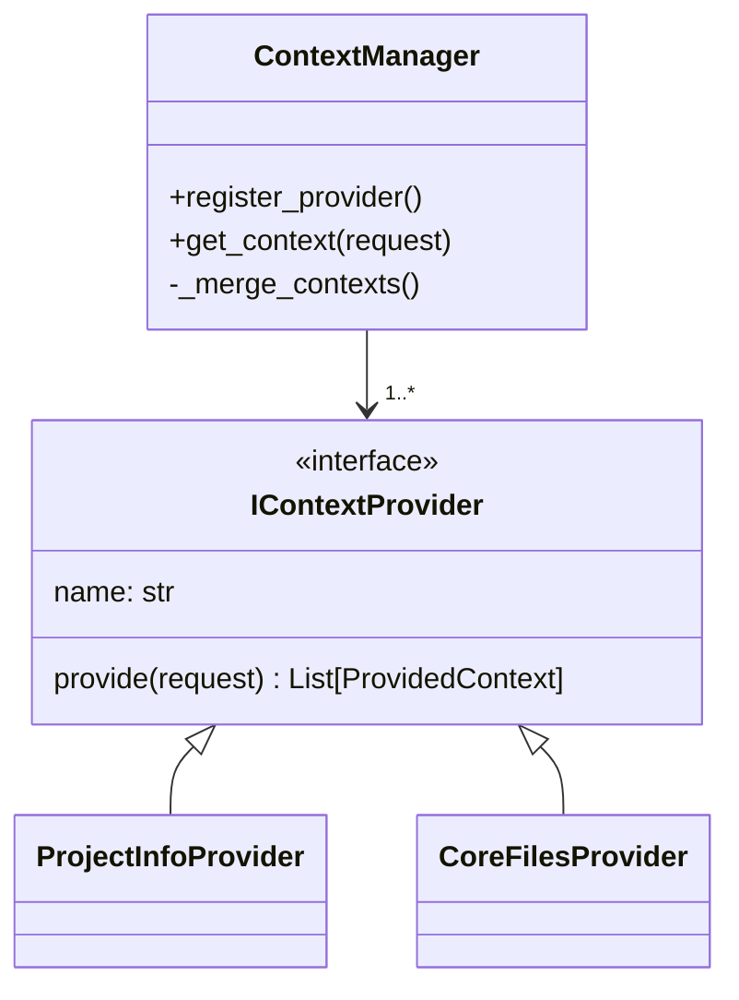
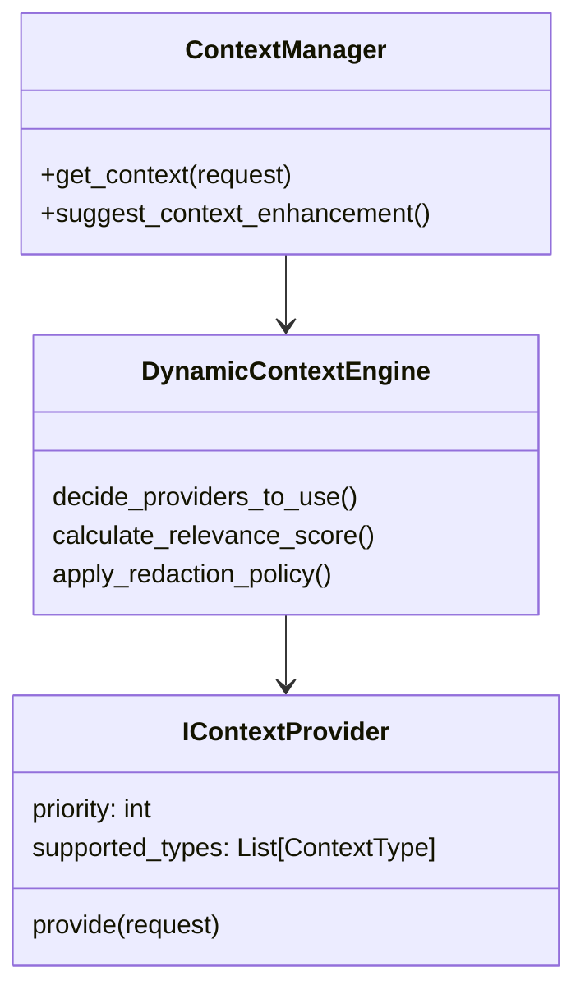
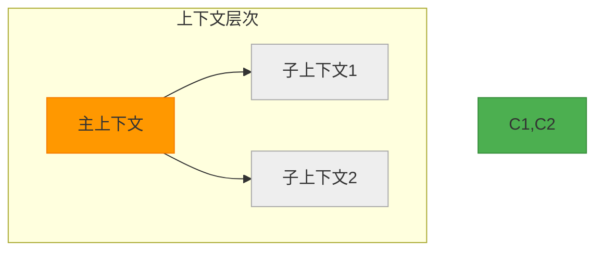
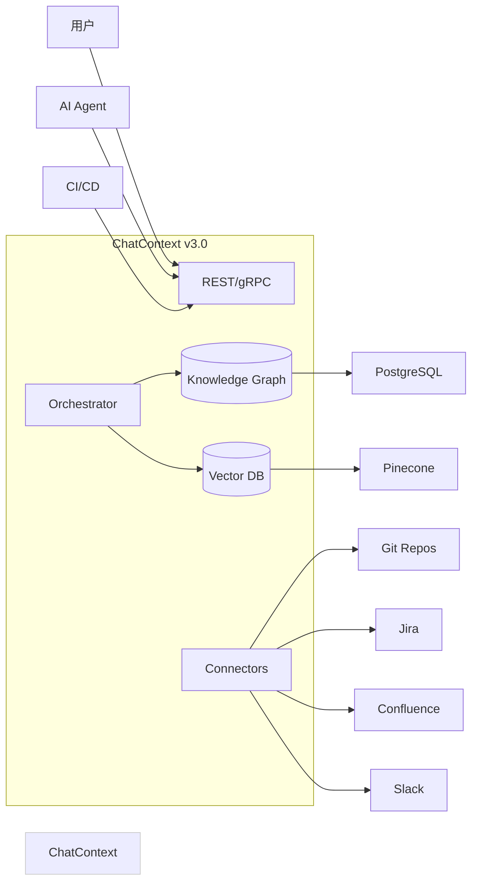
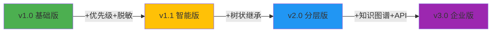

# ChatContext 架构演进路线图：从上下文生成器到智能知识中枢

基于您提供的 v0 版本和 ChatFlow 的演进路径，我为 **ChatContext** 设计了一套与之协同的四阶段架构演进方案。每个阶段都与对应版本的 ChatFlow 深度集成，共同构建完整的 AI 协作系统。

---

## 🎯 核心演进理念

| 阶段 | ChatContext 定位 | 与 ChatFlow 关系 |
|------|------------------|------------------|
| **v1.0** | 可靠上下文组装器 | ChatFlow v1.0 的“感知器官” |
| **v1.1** | 智能上下文策展人 | ChatFlow v1.1 的“记忆系统” |
| **v2.0** | 分层认知处理器 | ChatFlow v2.0 的“知识引擎” |
| **v3.0** | 组织级知识中枢 | ChatFlow v3.0 的“企业大脑” |

> 演进核心：从“数据聚合”到“认知服务”，最终成为组织的**可编程知识基础设施**。

---

## 📦 阶段一：v1.0 - 可靠上下文组装器（适配 ChatFlow v1.0）

### 定位
为个人开发环境提供**稳定、可复现**的上下文生成能力，解决多模块协作时上下文不一致问题。

### 关键设计


### 核心增强
1. **请求标准化**：`ContextRequest` 增加 `chatflow_instance_id` 字段，与 ChatFlow 实例绑定。
2. **缓存机制**：对频繁访问的文件内容进行内存缓存（TTL=60秒）。
3. **错误隔离**：任一 Provider 失败不影响整体流程，记录错误但继续执行。

### 接口演进
```python
# 新增字段
@dataclass
class ContextRequest:
    chatflow_instance_id: str  # 关联 ChatFlow 实例
    feature_id: str
    current_phase: str
    task_description: str
    # ... 其他字段

# 返回结构化对象（而非仅字典）
@dataclass  
class FinalContext:
    merged_data: Dict[str, Any]
    provider_diagnostics: List[Dict]  # 各Provider执行情况
    generation_time: float
```

### 与 ChatFlow v1.0 集成
```python
# ChatCoder 中典型调用
instance_id = flow_engine.start_workflow_instance(...)

request = ContextRequest(
    chatflow_instance_id=instance_id,
    feature_id="feat_auth",
    current_phase="implementation"
)

context = context_manager.get_context(request)
prompt = template.render(**context.merged_data)
```

> **价值**：确保不同 Agent 模块生成的上下文基于同一事实源。

---

## 🌟 阶段二：v1.1 - 智能上下文策展人（适配 ChatFlow v1.1）

### 定位
在可靠性的基础上增加**智能性**，根据任务类型、风险等级动态调整上下文范围和深度。

### 关键设计


### 核心增强

#### 1. **优先级与条件加载**
```python
class IContextProvider:
    def get_priority(self, request: ContextRequest) -> int:
        """根据请求动态返回优先级"""
        if request.current_phase == "security-review":
            return 100 if self.name == "SecurityScanner" else 50
        return 75
    
    def can_provide(self, request: ContextRequest) -> bool:
        """前置检查是否应参与本次生成"""
        return request.project_type in self.supported_project_types
```

#### 2. **相关性评分与摘要**
```python
@dataclass
class ProvidedContext:
    content: str
    type: ContextType
    source: str
    relevance_score: float = 1.0  # 0.0-1.0
    summary: Optional[str] = None  # 自动生成或提供
```

#### 3. **安全脱敏策略**
```python
class RedactionPolicy:
    def apply(self, text: str) -> str:
        # 移除API密钥、数据库密码等
        return re.sub(r'api_key\s*=\s*[\'"][^\'"]+[\'"]', 'api_key = [REDACTED]', text)

# 在 ContextManager 中集成
context = redaction_policy.apply(context)
```

#### 4. **上下文建议引擎**
```python
def suggest_context_enhancement(self, request: ContextRequest) -> List[str]:
    """建议用户添加哪些额外上下文"""
    suggestions = []
    if "database" in request.task_description and not self._has_db_schema(request):
        suggestions.append("Consider adding database schema for better code generation")
    return suggestions
```

### 与 ChatFlow v1.1 集成
```python
# 利用 automation_level 控制上下文深度
request = ContextRequest(
    chatflow_instance_id=instance_id,
    automation_level=user_prefs.automation_level  # 传递给 Provider 决策
)

context = context_manager.get_context(request)

# Dry Run 时获取建议
if is_dry_run:
    suggestions = context_manager.suggest_context_enhancement(request)
    ui.show_suggestions(suggestions)
```

> **价值**：上下文不再是“全量堆砌”，而是“精准投喂”。

---

## 🌐 阶段三：v2.0 - 分层认知处理器（适配 ChatFlow v2.0）

### 定位
支持递归工作流的**分层上下文管理**，实现父子任务间的知识继承与隔离。

### 关键设计


### 核心增强

#### 1. **树状上下文继承**
```python
@dataclass
class ContextRequest:
    parent_context_request_id: Optional[str] = None  # 支持递归
    inheritance_mode: str = "full"  # full, partial, isolated
    
    def inherit_from_parent(self, parent_context: FinalContext):
        """从父请求继承基础信息"""
        if self.inheritance_mode != "isolated":
            self.feature_id = parent_context.feature_id
            self.project_info = parent_context.merged_data.get("project")
```

#### 2. **上下文作用域**
```python
class ScopedContextManager:
    def __init__(self, root_request: ContextRequest):
        self.root_request = root_request
        self.context_cache = {}  # {request_id: FinalContext}
    
    def get_context_for_subtask(self, sub_request: ContextRequest) -> FinalContext:
        # 自动建立父子关系
        sub_request.parent_context_request_id = self.root_request.request_id
        return self.get_context(sub_request)
```

#### 3. **增量上下文更新**
```python
class IncrementalContextUpdater:
    def update_context(self, base_context: FinalContext, delta: Dict) -> FinalContext:
        """在已有上下文基础上增量更新"""
        new_data = deep_merge(base_context.merged_data, delta)
        return FinalContext(merged_data=new_data, ...)
```

#### 4. **跨层级知识检索**
```python
def cross_context_query(self, root_request_id: str, query: str) -> List[SearchResult]:
    """在整个上下文树中搜索相关信息"""
    all_contexts = self._get_all_descendant_contexts(root_request_id)
    results = []
    for ctx in all_contexts:
        matches = semantic_search(ctx.merged_data, query)
        results.extend(matches)
    return sorted(results, key=lambda x: x.score, reverse=True)
```

### 与 ChatFlow v2.0 集成
```python
# 主工作流生成上下文
main_context = context_manager.get_context(main_request)

# 创建子工作流时自动继承
sub_request = ContextRequest(
    parent_context_request_id=main_context.request_id,
    inheritance_mode="partial",  # 仅继承必要信息
    task_description="Refactor database layer"
)

sub_context = context_manager.get_context(sub_request)
```

> **价值**：避免重复扫描整个项目，提升效率；保持知识一致性。

---

## ☁️ 阶段四：v3.0 - 组织级知识中枢（适配 ChatFlow v3.0）

### 定位
作为企业级**统一知识服务平台**，整合代码库、文档、会议记录等多元数据源。

### 关键设计


### 核心增强

#### 1. **多源连接器生态**
```python
class IDataSourceConnector:
    def ingest(self) -> Iterator[DocumentChunk]:
        """拉取并分块处理数据"""
    
    def search(self, query: str) -> List[SearchResult]:
        """针对该源的专用搜索"""

# 内置连接器
- GitRepositoryConnector
- JiraIssueConnector  
- ConfluencePageConnector
- SlackHistoryConnector
```

#### 2. **知识图谱存储**
```python
# 将上下文存储为图结构
Node:CodeFile -- contains --> Node:Function
Node:JiraIssue -- implemented_by --> Node:PullRequest
Node:Developer -- authored --> Node:CodeFile

# 支持图查询
MATCH (issue:JiraIssue)-[:implemented_by]->(pr:PullRequest)
WHERE issue.key = "PROJ-123"
RETURN pr.title, pr.author
```

#### 3. **向量索引与语义搜索**
```python
class VectorIndex:
    def add_document(self, doc: DocumentChunk):
        embedding = llm_embed(doc.text)
        pinecone.upsert(embedding, metadata=doc.metadata)
    
    def semantic_search(self, query: str, top_k: int) -> List[ScoredResult]:
        query_embedding = llm_embed(query)
        return pinecone.query(query_embedding, top_k)
```

#### 4. **权限感知上下文**
```python
class PermissionAwareContextManager:
    def get_context(self, request: ContextRequest, user_permissions: UserPermissions) -> FinalContext:
        # 根据用户权限过滤敏感信息
        raw_context = super().get_context(request)
        filtered_data = apply_permission_filter(raw_context.merged_data, user_permissions)
        return FinalContext(merged_data=filtered_data, ...)
```

#### 5. **知识变更通知**
```python
class KnowledgeChangeNotifier:
    def on_source_update(self, source: str, changes: List[ChangeEvent]):
        # 发布事件到消息队列
        kafka_producer.send("knowledge-updates", {
            "source": source,
            "changes": changes,
            "timestamp": now()
        })
        
        # 通知相关工作流可能需要重新生成上下文
        trigger_context_refresh_for_affected_workflows(changes)
```

### 与 ChatFlow v3.0 集成
```python
# Web UI 调用
POST /api/v3/context
{
  "chatflow_instance_id": "wfi_main",
  "tenant_id": "acme-corp",
  "user_id": "alice",
  "include_sources": ["git", "jira"]
}
→ 200 OK { "merged_data": {...}, "diagnostics": [...] }

# 结果用于驱动工作流
flow_client.trigger_next_step(instance_id, trigger_data={
    "context_summary": context.merged_data["summary"],
    "related_issues": context.merged_data["jira_issues"]
})
```

> **价值**：将分散的知识资产转化为 AI 可理解的统一视图。

---

## 🔄 演进路线实施策略

| 阶段 | 目标 | 技术栈演进 |
|------|------|------------|
| **v1.0 → v1.1** | 智能策展 | Python → +pydantic +spacy |
| **v1.1 → v2.0** | 层次化处理 | 单机 → 树状数据结构 |
| **v2.0 → v3.0** | 规模化应用 | 库 → 微服务 + 数据库 |

### 推荐升级路径


---

## 💡 总结

ChatContext 的演进路径完美呼应了 ChatFlow 的发展：

1. **v1.x**：解决**正确性**问题 —— 确保上下文准确、一致、安全。
2. **v2.0**：解决**结构性**问题 —— 匹配递归工作流的层次化认知需求。
3. **v3.0**：解决**规模性**问题 —— 将个人知识管理升级为组织智能基石。

最终形态的 ChatContext 将不仅是“上下文生成器”，更是：
- **AI 的记忆体**：长期存储和召回关键信息
- **团队的外脑**：打破知识孤岛，实现智能协同
- **企业的神经末梢**：实时感知并整合全域知识变化

这套设计让您能够以最小成本起步，随着需求增长平滑演进，最终构建出支撑整个组织 AI 能力的**认知基础设施**。
