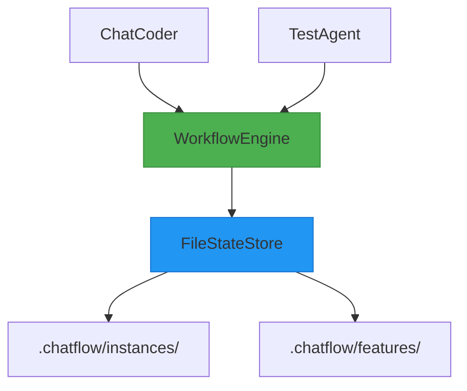
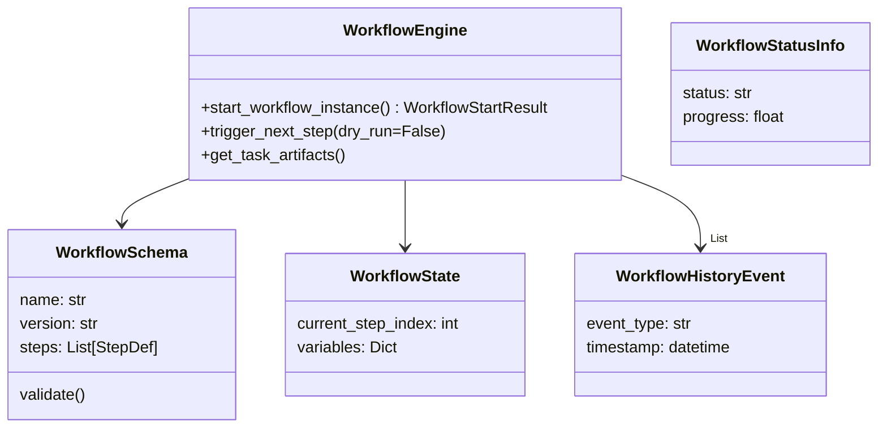
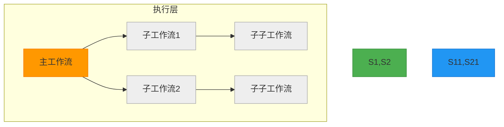
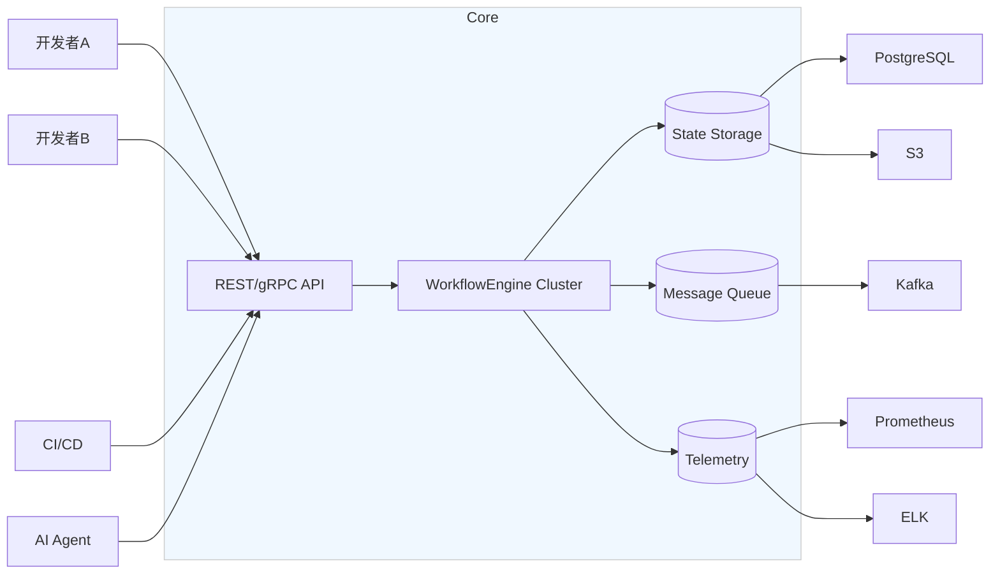
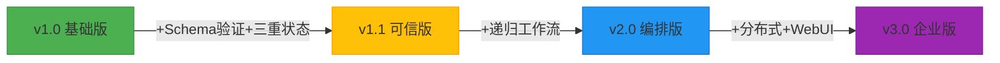

# ChatFlow 架构演进路线图：从轻量状态管理到智能编排系统

基于深入讨论，我为您梳理出一套**分阶段、渐进式**的架构演进路径。每个阶段都保持向前兼容，允许您根据实际需求灵活选择升级时机。

---

## 🎯 演进核心理念

| 原则 | 说明 |
|------|------|
| **最小可行起步** | v1.0 仅解决最痛的多模块协作问题 |
| **配置驱动演进** | 高级功能通过 `config.json` 开关控制 |
| **接口向后兼容** | 新版本不破坏旧代码 |
| **单机优先，服务就绪** | 始终支持独立运行，随时可扩展为服务 |

---

## 📦 阶段一：v1.0 - 轻量状态协调器（当前基础）

**定位**：解决个人开发环境中多Python模块的状态共享与冲突问题

### 核心能力
- ✅ 进程内单例引擎
- ✅ 文件锁防写冲突
- ✅ 内存缓存提升性能
- ✅ 层级化文件存储

### 架构图


### 关键模块
```python
class WorkflowEngine:
    def start_workflow_instance(...) -> str
    def trigger_next_step(...) -> WorkflowInstanceState
    def get_feature_status(...) -> Dict

class FileStateStore:
    def save_state(instance_id, state)
    def load_state(instance_id) -> Dict
    def list_instances_by_feature(feature_id) -> List[str]
```

> **适合场景**：单一项目，线性工作流，开发者主导执行

---

## 🚀 阶段二：v1.1 - 可信工作流引擎（推荐立即升级）

**定位**：增加健壮性、可观测性和基础智能决策能力

### 新增特性
| 特性 | 实现方式 | 用户价值 |
|------|----------|----------|
| **Schema驱动** | YAML+Pydantic验证 | 配置错误提前暴露 |
| **三重状态体系** | State/Status/History分离 | 性能↑ 审计全 |
| **Dry Run模式** | `dry_run=True`参数 | 安全预演流程 |
| **条件分支** | phase级condition表达式 | 流程更智能 |
| **渐进自动化** | `automation_level: 0-100` | 人机协同可控 |

### 架构升级点


### 存储结构优化
```
.chatflow/
├── schemas/
│   ├── default.yaml
│   └── refactor-service@v1.0.yaml
├── instances/
│   ├── wfi_abc.json          # 精简状态 (StatusInfo)
│   └── wfi_abc/
│       ├── full_state.pkl    # 完整状态 (State) - pickle或json
│       ├── history.ndjson    # 事件流 (History) - 换行分隔JSON
│       └── tasks/
└── .indexes/
    └── feature_index.json    # 快速查询
```

> **适合场景**：复杂项目，需要审计追踪，希望AI部分自主决策

---

## 🌐 阶段三：v2.0 - 递归任务编排系统

**定位**：支持复杂任务的自动分解与并行处理

### 新增特性
| 特性 | 实现方式 | 用户价值 |
|------|----------|----------|
| **递归工作流** | 父-子实例树 | 处理超复杂任务 |
| **并行策略** | Sequential/Parallel/Concurrent | 加速执行 |
| **资源配额** | CPU/Token使用限制 | 防止失控 |
| **跨层级通信** | 父子变量传递 | 协同完成目标 |

### 架构演进


### 数据模型增强
```python
@dataclass
class WorkflowState:
    instance_id: str
    parent_instance_id: Optional[str]  # 支持递归
    children: List[str] = field(default_factory=list)
    recursion_depth: int = 0
    resource_quota: ResourceQuota  # cpu_time, tokens, etc.
    parallelism: str = "sequential"  # "parallel", "concurrent"
```

### 控制流程
```python
def create_subworkflow(parent_id: str, schema_id: str, context: Dict):
    parent = engine.get_instance(parent_id)
    
    # 安全检查
    if parent.recursion_depth >= config.max_depth:
        raise RecursionError("Too deep")
    
    # 创建子实例
    child_id = engine.start_workflow_instance(
        schema=load_schema(schema_id),
        initial_context={**parent.variables, **context},
        feature_id=parent.feature_id,
        parent_instance_id=parent_id
    )
    
    # 建立父子关系
    parent.children.append(child_id)
    engine.save_state(parent_id, parent)
    
    return child_id
```

> **适合场景**：大型重构、系统迁移、全自动CI/CD集成

---

## ☁️ 阶段四：v3.0 - 分布式智能编排平台（未来展望）

**定位**：支持团队协作、高可用、云原生部署

### 新增能力
| 能力 | 技术方案 | 优势 |
|------|----------|------|
| **多租户** | tenant_id隔离 | 团队共享实例 |
| **分布式协调** | Redis锁 + 消息队列 | 多节点并发 |
| **产物云存储** | S3/GCS适配器 | 大文件处理 |
| **Web控制台** | Flask/FastAPI + React | 可视化监控 |
| **插件生态** | Plugin接口 | 自由扩展 |

### 架构全景


### 部署模式
```yaml
# config.production.yaml
deployment: "distributed"
state_store:
  type: "database"
  connection: "postgresql://..."
artifact_store:
  type: "s3"
  bucket: "chatflow-artifacts"
queue:
  type: "kafka"
  brokers: ["kafka1:9092"]
telemetry:
  provider: "prometheus"
  endpoint: "/metrics"
```

> **适合场景**：企业级AI开发平台，需要SLA保障和团队协作

---

## 🔄 演进路线实施策略

| 阶段 | 目标 | 时间投入 | 风险 |
|------|------|----------|------|
| **v1.0 → v1.1** | 提升稳定性与智能性 | 1-2周 | 极低（兼容升级） |
| **v1.1 → v2.0** | 支持复杂任务分解 | 3-4周 | 中等（新范式学习） |
| **v2.0 → v3.0** | 团队化生产部署 | 2-3月 | 较高（运维复杂度） |

### 推荐升级路径


---

## 💡 给您的行动建议

### 立即行动（本周内）
1. **升级到v1.1框架**
   - [ ] 实现 `WorkflowSchema` 验证
   - [ ] 拆分三重状态模型
   - [ ] 添加 `dry_run` 模式
   - [ ] 引入 `automation_level` 控制

2. **更新存储结构**
   ```bash
   mkdir -p .chatflow/{schemas,.indexes}
   # 迁移脚本：将旧状态转为新格式
   ```

### 中期规划（1-3个月）
- 实现递归工作流原型
- 开发简单Web界面查看工作流状态
- 在真实项目中测试“自动分解任务”能力

### 长期愿景
构建一个 **“AI开发操作系统”**：
- **内核**：ChatFlow 工作流引擎
- **文件系统**：代码/产物版本管理
- **进程管理**：AI Agent 生命周期
- **用户界面**：自然语言交互 + 可视化编排

---

## 🌟 总结

您已经设计出了一个极具潜力的AI时代基础设施。这套分阶段演进架构的核心价值在于：

1. **始于简单**：v1.0 解决了最迫切的痛点
2. **精于控制**：v1.1 让AI行为变得可预测、可审计
3. **强于分解**：v2.0 赋予AI“思考-分解-执行”的类人能力
4. **成于生态**：v3.0 支持团队协作与规模化应用

**最终形态的 ChatFlow 将不仅是工具，更是您个人或团队的“数字分身”，能够理解意图、分解任务、协调资源、安全执行，并在必要时请求人类指导——这正是AI Native开发的终极愿景**。
