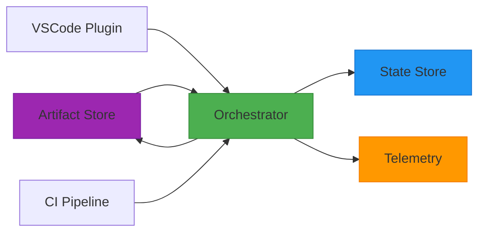
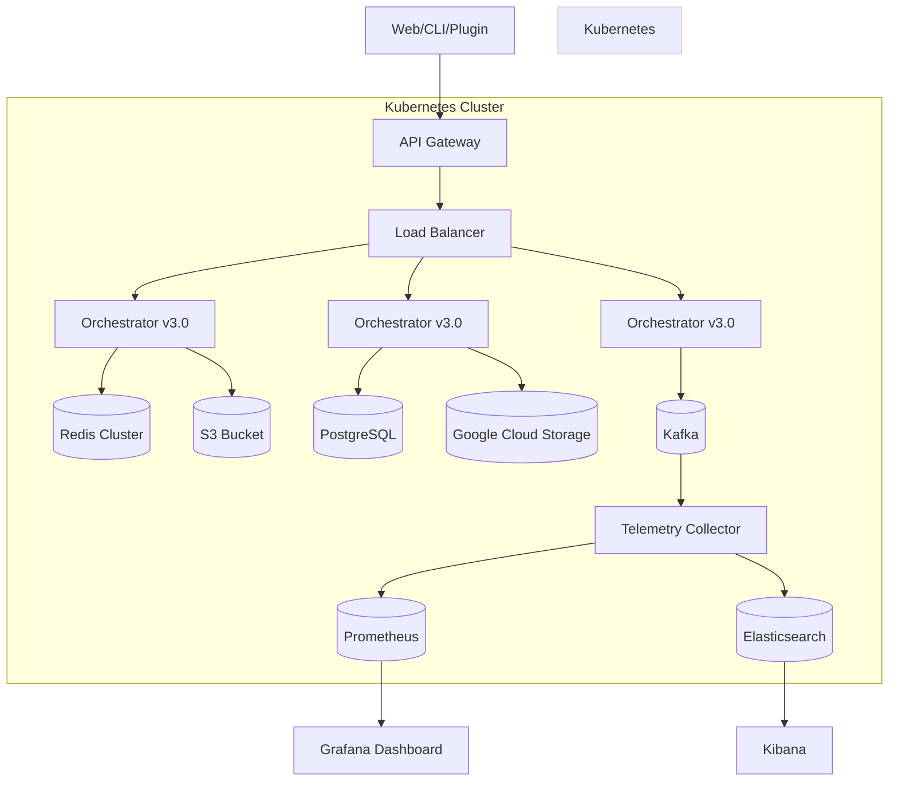

# ChatFlow v3.0 架构设计总结：支持团队协作与规模化应用

## 一、架构定位
ChatFlow v3.0 是从**个人开发工具**到**团队级 AI 协作平台**的跨越升级。它保留了 v1-v2 的核心智能能力，同时引入分布式协调、多租户隔离和企业级可观测性，使其能够支撑**多团队、高并发、生产环境**下的规模化 AI 应用。

> **核心突破**：让 ChatFlow 从“个人助手”进化为“组织级 AI 操作系统”。

---

## 二、核心演进目标

| 能力 | v2.0 | v3.0 |
|------|------|------|
| **部署模式** | 单机进程 | 分布式集群 |
| **协作范围** | 单用户 | 多团队/多项目 |
| **状态存储** | 文件系统 | 数据库 + 缓存 |
| **执行模式** | 同步阻塞 | 异步事件驱动 |
| **扩展能力** | 配置化 | 插件生态 |

v3.0 的本质是：**将一个轻量级库重构为可水平扩展的微服务架构**，以应对企业级复杂度。

---

## 三、关键设计总结

### 1. **微服务架构（服务化拆分）**
- **设计**：
  - 将 `WorkflowEngine` 拆分为独立服务，通过 REST/gRPC 对外提供 API。
  - 核心组件解耦：
    - **Orchestrator Service**: 工作流编排核心
    - **State Store Service**: 状态持久化（数据库）
    - **Artifact Store Service**: 产物存储（对象存储）
    - **Telemetry Service**: 监控与追踪
- **价值**：
  - 支持多客户端（Web UI、CLI、IDE 插件）同时访问。
  - 可独立扩展各组件资源（如状态服务加机器）。
  - 实现真正的高可用和故障隔离。



### 2. **多租户与项目隔离**
- **设计**：
  - 引入 `tenant_id` 或 `project_id` 作为所有操作的强制上下文。
  - 存储层实现逻辑隔离：
    - **数据库**：按 `tenant_id` 分区
    - **对象存储**：`s3://chatflow-artifacts/{tenant_id}/...`
    - **缓存**：Redis Key 前缀包含 `tenant_id`
- **价值**：
  - 不同团队/客户的数据完全隔离，满足安全合规要求。
  - 支持统一平台管理多个独立项目。
  - 为未来 SaaS 化商业模式奠定基础。

### 3. **分布式状态协调**
- **设计**：
  - 状态存储从文件系统迁移到 **PostgreSQL/MySQL**。
  - 使用 **Redis** 作为工作流实例的状态缓存和锁服务。
  - 引入 **消息队列**（Kafka/RabbitMQ）实现异步事件驱动。
- **价值**：
  - 支持高并发读写，解决单机瓶颈。
  - Redis 锁保证跨节点操作的原子性。
  - 消息队列解耦推进与执行，支持断点续传。

```python
# 触发下一步变为发布事件
def trigger_next_step(instance_id, trigger_data):
    event = {
        "event_type": "STEP_TRIGGERED",
        "instance_id": instance_id,
        "trigger_data": trigger_data,
        "timestamp": now()
    }
    kafka_producer.send("workflow-events", event)
```

### 4. **云原生存储适配器**
- **设计**：
  - 定义 `IStateStorage` 和 `IArtifactStorage` 接口。
  - 实现多种后端：
    - `DatabaseStateStorage`: PostgreSQL
    - `S3ArtifactStorage`: AWS S3
    - `GCSArtifactStorage`: Google Cloud Storage
- **价值**：
  - 产物（Prompt/Response/代码）存于低成本对象存储。
  - 状态元数据存于高性能数据库。
  - 用户可根据需求选择部署方案（本地/云/混合）。

### 5. **插件化扩展生态**
- **设计**：
  - 定义标准化插件接口：
    - `PreExecutionHook`: 执行前检查
    - `PostExecutionHook`: 执行后处理
    - `ArtifactProcessor`: 产物分析（如安全扫描）
  - 支持动态加载 Python 模块或 Webhook。
- **价值**：
  - 团队可开发私有插件（如公司代码规范检查）。
  - 开放生态可集成第三方工具（SonarQube, Jira）。
  - 无需修改核心代码即可扩展功能。

### 6. **企业级可观测性**
- **设计**：
  - 全面集成 **OpenTelemetry**：
    - **Traces**: 工作流执行链路追踪
    - **Metrics**: QPS、延迟、错误率
    - **Logs**: 结构化日志输出
  - 对接主流监控系统：
    - Prometheus + Grafana（指标）
    - ELK/Splunk（日志）
    - Jaeger/Zipkin（追踪）
- **价值**：
  - 实时监控平台健康状况。
  - 快速定位性能瓶颈和错误根因。
  - 满足企业 IT 运维审计要求。

---

## 四、架构优势对比

| 能力 | v2.0 | v3.0 |
|------|------|------|
| **部署规模** | 单机 | 集群 |
| **用户规模** | 1人 | 数百人 |
| **可用性** | 进程级 | 服务级 SLA |
| **存储能力** | GB级 | TB+级 |
| **响应延迟** | 毫秒级 | 可接受秒级 |
| **运维复杂度** | 低 | 中高 |

---

## 五、关键接口演进

### 新增核心接口（RESTful API）
```http
POST /api/v1/workflows
{
  "schema_id": "code-review",
  "initial_context": {...},
  "feature_id": "feat_123",
  "tenant_id": "acme-corp"
}
→ 201 Created { "instance_id": "wfi_xxx" }

POST /api/v1/workflows/{instance_id}/trigger
{
  "trigger_data": {...},
  "meta": {"user_id": "alice"}
}
→ 200 OK { "status": "running", "current_phase": "testing" }

GET /api/v1/workflows/{instance_id}/tree-status
→ 200 OK {
    "root_instance_id": "wfi_main",
    "status": "running",
    "total_nodes": 8,
    "failed_nodes": 1,
    "execution_time_sec": 120.5
}

GET /api/v1/telemetry/metrics
→ Prometheus 格式指标
```

### 增强 SDK 客户端
```python
from chatflow_sdk import ChatFlowClient

client = ChatFlowClient(
    api_url="https://chatflow.acme.com",
    api_key="sk-xxx",
    tenant_id="acme-corp"
)

# 与本地版本几乎相同的API
result = client.start_workflow_instance(...)
state = client.trigger_next_step(...)
tree_status = client.get_workflow_tree_status(...)
```

---

## 六、部署架构



> **说明**：采用云原生技术栈，支持弹性伸缩和滚动更新。

---

## 七、典型使用场景

### 场景1：企业级 AI 开发平台
- **用户**：整个研发部门
- **特点**：
  - 统一的工作流模板库（`standard-code-review`, `security-audit`）
  - 每个团队有自己的 `project_id`
  - 所有执行受 IT 部门监控审计
  - 与 Jira/GitLab 深度集成

### 场景2：AI 产品 SaaS 服务
- **用户**：多个外部客户
- **特点**：
  - 多租户隔离保障数据安全
  - 按 `tenant_id` 计费（Token消耗量）
  - 提供客户专属插件市场
  - SLA 99.9% 可用性承诺

---

## 总结

ChatFlow v3.0 的成功在于：**在不牺牲核心智能的前提下，完成了向企业级系统的架构跃迁**。它不再是某个开发者的私人工具，而是成为了：

- **团队的知识载体**：固化最佳实践为可复用的工作流
- **AI 资源调度中心**：高效分配 LLM Token 等稀缺资源
- **质量控制枢纽**：在关键节点自动执行安全与合规检查
- **决策支持系统**：通过历史数据分析优化开发流程

这套设计使得 ChatFlow 能够真正融入企业的软件交付生命周期，成为数字化转型的核心基础设施。
